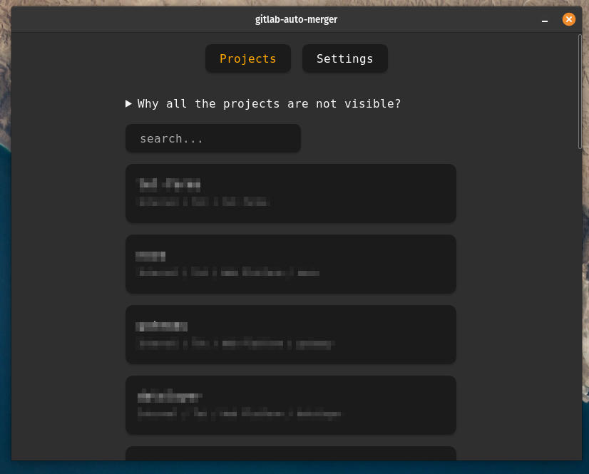
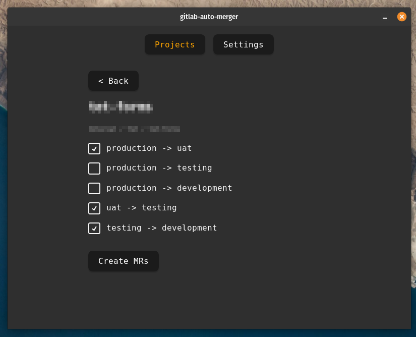
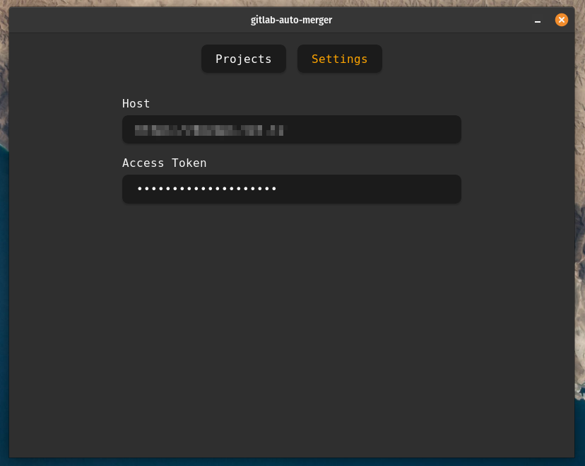

# Gitlab Auto Merger

This app provides convenient UI to automatically create multiple MRs for specific repository.

## How to use

Go to `settings` section and configure:
- Host of the Gitlab instance, e.g. `https://test.company.com`.
- Gitlab personal access token, with scope `api`.

Go to `projects` section and the projects should be listed.

Click on the project, choose which MRs to create and confirm.

## Screenshots

List of repositories

Merge request creation

Settings

